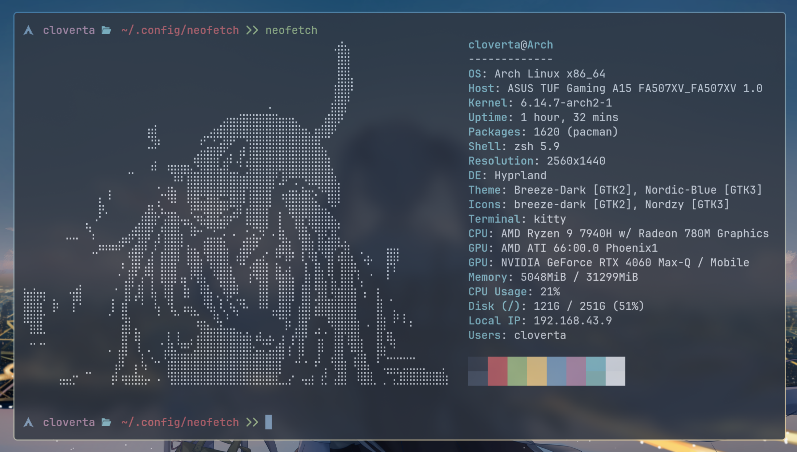

# archlinux 系统美化（终端篇）

> ### 🌺 爱美之心，人皆有之
>
> 美化这个话题是永恒的。有些人用 Linux 的原因就是一开始被美化后桌面的截图惊艳到了
>
> 这一小节将会介绍如何对 KDE 桌面环境进行美化。受限于篇幅，本小节分为上下篇

## 1. 设置 Konsole 样式

打开 Konsole， _设置_ > _编辑当前方案_ > _外观_，选择 `Red-Black` （或你喜欢的颜色主题），应用确认即可。

## 2. zsh 美化

::: tip ℹ️ 提示

确保你安装过 zsh ，安装方法及相关配置可在 [可选配置（基础）](/guide/advanced/optional-cfg-1.html) 一章中查看。

[oh-my-zsh](https://ohmyz.sh/) 实际上并没有那么好用，反而拖慢了 Zsh 的速度，本指南不会介绍。

若有需要请自行查阅相关资料。

:::

### 2-1. powerlevel10k

由于本指南不使用 `oh-my-zsh` ,因此使用另一个 Zsh 框架 `zim` 安装 powerlevel10k。

1.  安装 `zim` 。

```sh
curl -fsSL https://raw.githubusercontent.com/zimfw/install/master/install.zsh | zsh
```

2.  编辑 Zsh 配置文件 `~/.zimrc` ：

```sh
vim ~/.zimrc
```

3.  在文件最后加入下面的一行文字，以添加 `powerlevel10k` 模块，然后退出。

```
zmodule romkatv/powerlevel10k
```

4.  安装 `powerlevel10k` 模块，在终端输入如下命令即可。

```sh
zimfw install
```

安装之后，`powerlevel10k`会让你进行配置。

在此时配置时，很多图标符号看不到，因为 `powerlevel10k` 中包含许多特殊图标符号，需要与之兼容的字体。

5.  安装 Nerd Font 字体

Nerd Fonts 是一系列打过补丁的字体，支持 `powerlevel10k` 中的图标。

AUR 和 ArchLinuxCN 源中都有很多 Nerd Font，在终端使用 yay 搜索安装即可。

```sh
yay -Ss nerd-font
```

个人推荐使用 [ttf-jetbrains-mono-nerd](https://archlinux.org/packages/extra/any/ttf-jetbrains-mono-nerd/) 字体，可在 aur 中安装

```sh
sudo pacman -S ttf-jetbrains-mono-nerd
```

安装完任意一个 Nerd Font 字体后，打开 Konsole 的 _设置_ > _编辑当前方案_ > _外观_，把 _字体_ 改为刚刚安装的 Nerd Font 即可。

现在再打开 `powerlevel10k` 配置（`p10k configure`），就可以看到图标符号，正常配置了。

### 2-2. grml's zsh config

如果你不想麻烦，想要一个看起来还算可以并且包含许多高级功能（如拼写纠错）的 zsh 配置，可以使用 grml's zsh config。

```sh
sudo pacman -S grml-zsh-config
```

然后重新登录就可。如果出现了什么问题，请删除当前的 .zshrc 然后重新撰写一份。

## 3. vim 美化

安装 Vim-plug。这是一个极简风的 vim 插件管理器。

```sh
curl -fLo ~/.vim/autoload/plug.vim --create-dirs \
    https://raw.githubusercontent.com/junegunn/vim-plug/master/plug.vim
```

然后安装 Airline. 它是一个状态栏插件。

把下面的内容加入 .vimrc 中

```text
call plug#begin()

Plug 'vim-airline/vim-airline'
Plug 'vim-airline/vim-airline-themes'
let g:airline_theme='ayu_dark'

call plug#end()
```

然后进入 vim, 运行

```sh
:PlugInstall
```

## 4. ASCII 艺术与终端玩具

### neofetch

<del>Arch Linux核心出装</del>

1. 安装[neofetch](https://aur.archlinux.org/packages/neofetch)：

   **neofetch不在[Arch Linux官方仓库](https://archlinux.org/packages/)中，我们需要从AUR下载**

   ```bash
   yay -S neofetch
   ```

2. 运行仅需

   ```bash
   neofetch
   ```

   是不是很简单？<del>快去和群u炫耀吧！</del>

3. 自定义输出

   neofetch支持自定义输出内容（包括但不限于更改图标和输出文字）

   以下以更改输出系统图标为例。

   修改`~/.config/neofetch/config.conf`：

   ```shell
   vim ~/.config/neofetch/config.conf
   ```

   找到这一段配置文件

   ```shell
   # Image backend.
   #
   # Default:  'ascii'
   # Values:   'ascii', 'caca', 'chafa', 'jp2a', 'iterm2', 'off',
   #           'pot', 'termpix', 'pixterm', 'tycat', 'w3m', 'kitty'
   # Flag:     --backend
   image_backend="ascii"
   
   # Image Source
   #
   # Which image or ascii file to display.
   #
   # Default:  'auto'
   # Values:   'auto', 'ascii', 'wallpaper', '/path/to/img', '/path/to/ascii', '/path/to/dir/'
   #           'command output (neofetch --ascii "$(fortune | cowsay -W 30)")'
   # Flag:     --source
   #
   # NOTE: 'auto' will pick the best image source for whatever image backend is used.
   #       In ascii mode, distro ascii art will be used and in an image mode, your
   #       wallpaper will be used.
   image_source="auto"
   ```

   将上述代码中的`image_backend`值改为你需要的（这里我使用ascii）下面的`image_source`改为图像或ascii图画路径（例如`/path/to/ascii-art.txt`）。

   

### lolcat

用渐变为终端输出着色，看起来就像彩虹一样！

1. 安装 [lolcat](https://archlinux.org/packages/extra/any/lolcat/)：

   ```bash
   sudo pacman -S lolcat
   ```

2. 通过管道符（`|`）将其它命令（如 `neofetch`）的输出传递给 `lolcat`：

   ```bash
   neofetch | lolcat
   ```

   

### cowsay

将文本作为 ASCII 艺术牛的讲话文本输出。

1. 安装 [cowsay](https://archlinux.org/packages/extra/any/cowsay/)：

   ```bash
   sudo pacman -S cowsay
   ```

2. 通过管道符（`|`）将简短的其它命令输出传递给 `cowsay`：

   ```bash
   echo "archlinux 简明指南" | cowsay
   ```

   

### figlet

显示由不同风格的 ASCII 艺术字符组成的文本。

1. 安装 [figlet](https://archlinux.org/packages/extra/x86_64/figlet/)：

   ```bash
   sudo pacman -S figlet
   ```

2. 通过管道符（`|`）将简短的其它命令输出传递给 `figlet`：

   ```bash
   echo "Love Live Linux" | figlet
   ```

   

   更多样式请参阅 [figlet 官网](http://www.figlet.org/)。

### boxes

使用 ASCII 艺术风格的字符形状框来包围文本。

1. 安装 [boxes](https://archlinux.org/packages/extra/any/cowsay/)<sup>aur</sup>：

   ::: code-group

   ```bash [aur]
   yay -S boxes
   ```

   ```bash [aur (git)]
   yay -S boxes-git
   ```

   :::

2. 通过管道符（`|`）将简短的其它命令输出传递给 `boxes`：

   ```bash
   echo "archlinux 简明指南" | boxes -d diamonds -a c
   ```

   

   更多样式请参阅 [boxes 官网](https://boxes.thomasjensen.com/) 以及 [boxes repo](https://github.com/ascii-boxes/boxes)。

### cmatrix

向下滚动的代码流如同黑客帝国一样！

1. 安装 [cmatrix](https://archlinux.org/packages/extra/x86_64/cmatrix/)：

   ::: code-group

   ```bash [extra]
   sudo pacman -S cmatrix
   ```

   ```bash aur (git)
   yay -S aur/cmatrix-git
   ```

   :::

2. 输入以下命令：

   ```bash
   cmatrix
   ```

   

3. 按下 `q` 即可退出

### asciiquarium

将终端化身海洋馆！

1. 安装 [asciiquarium](https://archlinux.org/packages/extra/any/asciiquarium/)<sup>extra / aur</sup>：

   ::: code-group

   ```bash [extra]
   sudo pacman -S asciiquarium
   ```

   ```bash [aur (git)]
   yay -S aur/asciiquarium-git
   ```

   :::

2. 输入以下命令：

   ```bash
   asciiquarium
   ```

   

3. 按下 `q` 即可退出

### sl

终端里的小火车。

1. 安装 [sl](https://archlinux.org/packages/extra/x86_64/sl/)：

   ```bash
   sudo pacman -S sl
   ```

2. 输入以下命令：

   ```bash
   sl
   ```

   

## 5. Linux 彩蛋
